# 2021-2022学年第2学期

# **实 验 报 告**


- 课程名称: 编程语言原理与编译
- 实验项目: 期末大作业
- 专业班级: 计算1902
- 学生学号: 31901040
- 学生姓名: 陈世龙
- 实验指导教师: 郭鸣

### 项目自评表

| 解释器       | 自我评分(1-5) | 备注                       |
| ------------ | ------------- | -------------------------- |
| 自增自减     | 5             |                            |
| go for 循环  | 5             | go三种for循环              |
| go for range | 5             | 对数组支持for range        |
| 三目运算     | 5             |                            |
| 数组越界检查 | 5             |                            |
| return支持   | 4             | 对返回值进行简单支持       |
| 变量初始化   | 5             | 支持全局和局部的变量初始化 |

| 编译器           | 自我评分(1-5) | 备注                                   |
| ---------------- | ------------- | -------------------------------------- |
| go for 循环      | 5             |                                        |
| 三目运算         | 5             |                                        |

### 项目说明

> github 链接 https://github.com/vincent-vinf/microc

#### 项目内容

* 自增自减，实现了++i、i++、i--、--i
* 实现了go语法中的3种for循环
  * for {}死循环
  * for x < n {} 类似普通while循环
  * for i = 1; i < n; i++ {} 类似普通for循环
* go语法中for range
  * for a, b = range list {}，遍历数组，将下标和值分别放到a，b变量中
* 三目运算，实现 x = n > 10 ? n : 10
* 实现数组越界检查，当访问异常下标时报错
* return支持，只支持返回int
* 变量初始化，支持 int i = 0; 这样的变量初始化语句

#### 运行方法

为了方便测试，编写了一个简单的makefile

```makefile
FILENAME=ex_prime3.c
arg=8
run: clean
	dotnet run --project interpc.fsproj example/$(FILENAME) $(arg)

debug: clean
	dotnet run --project interpc.fsproj -g example/$(FILENAME) $(arg)

clean:
	dotnet clean interpc.fsproj
	
COMP_NAME=ex_comp
comp:
	dotnet clean microcc.fsproj
	dotnet run --project microcc.fsproj  example/$(COMP_NAME).c $(arg)
comp_run: comp
	dotnet clean machine.csproj
	dotnet run --project machine.csproj example/$(COMP_NAME).out $(arg)
comp_debug: comp
	dotnet clean machine.csproj
	dotnet run --project machine.csproj -t example/$(COMP_NAME).out $(arg)
```

运行解释器

```bash
## 解释器
# 直接运行
make
# 以调试模式运行
make debug
# 添加参数
make debug arg=8

## 解释器
make comp_run
make comp_debug
```


### 效果测试

#### 自增自减

```c
void main(int n) {
    ++n;
    print n;
    n++;
    print n;
    --n;
    print n;
    n--;
    print n;
}
```

token和抽象语法树


运行结果


#### 三目运算符

**解释器**

```c
void main(int n) {
    int x;
    x = n > 10 ? n : 10;
    print x;
}
```


**编译器**

编译

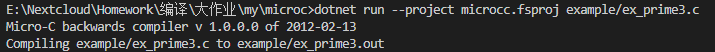

执行

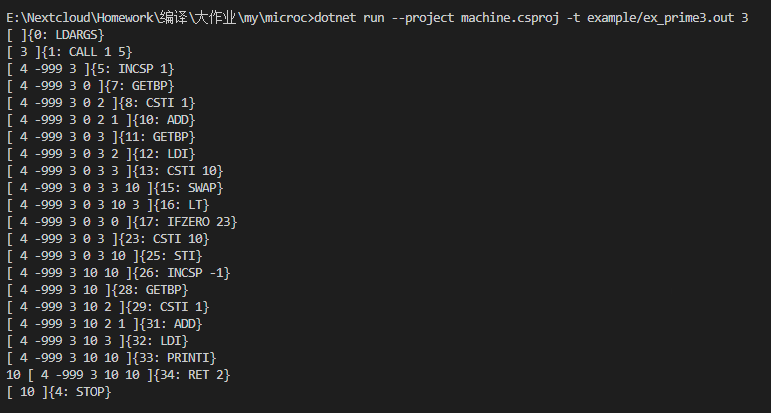

#### go for循环

在go语言当中，for有3种形式

```go
for {}
for x < 10 {}
for i := 0; i < 10; i++ {}
```

测试代码

```c
void main(int n) {
    int i;
    i = 0;
    for i < n {
        print i;
        i = i + 1;
    }
    println;
    int j;
    for j=0; j<n; j++{
        print j;
    }
}
```

**解释器**

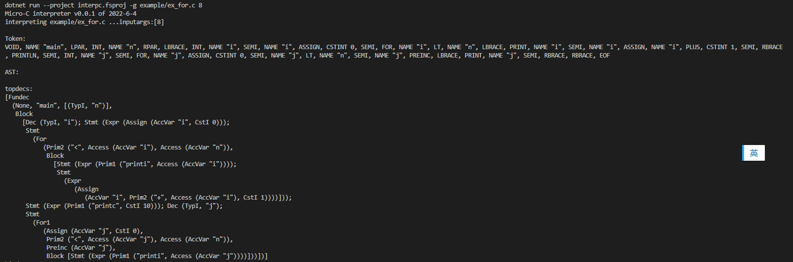

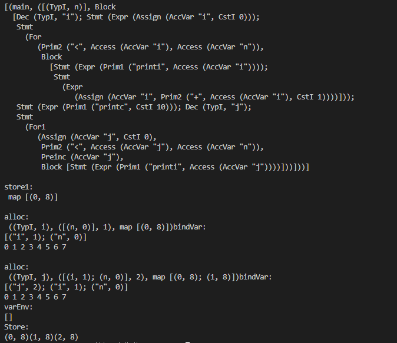

**编译器**

编译

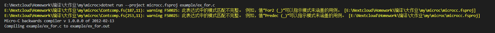

执行

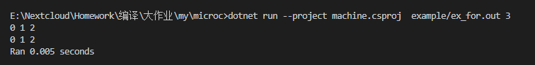

#### 数组下标越界检查

```c
void main(){
    int arr[2];
    arr[0] = 1;
    arr[1] = 2;
    print arr[0];
    print arr[1];
    print arr[2];
}
```

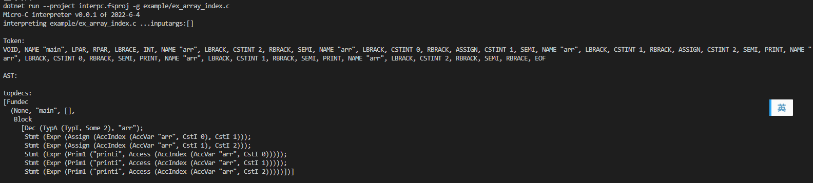

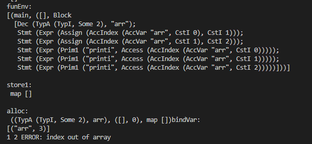

#### go for range

```c
void main() {
    int s[8];
    int j;
    // 用普通的for赋值
    for (j = 0; j < 8; j++){
        s[j] = j*2;
        print s[j];
    }
    int x;
    int y;
    for x,y = range s {
        print x;
        print y;
        println;
    }
}
```

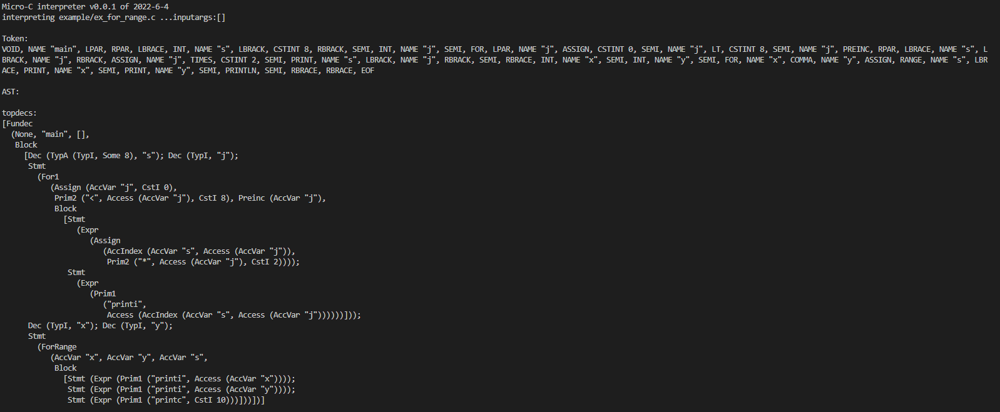

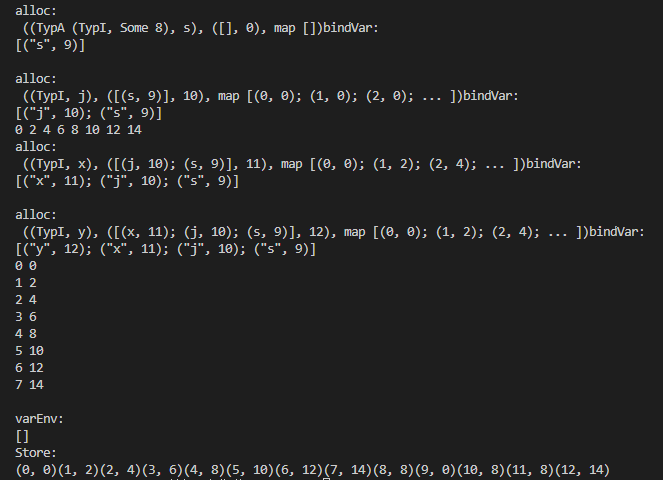

#### return支持

```c
void main() {
    print min(1,2);
}

int min(int a, int b){
    if (a < b) {
       return a;
    }
    return b;
}
```

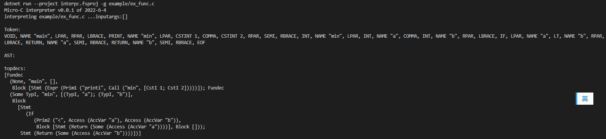

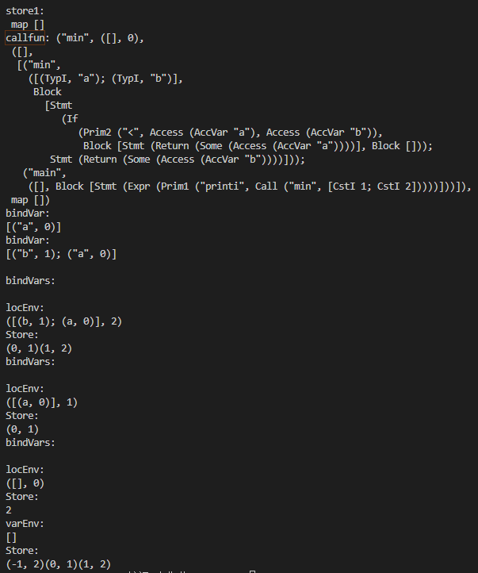

#### 变量初始化时赋值

```c
int i = 1;
void main() {
    int j = 1;
    print i;
    print j;
}
```

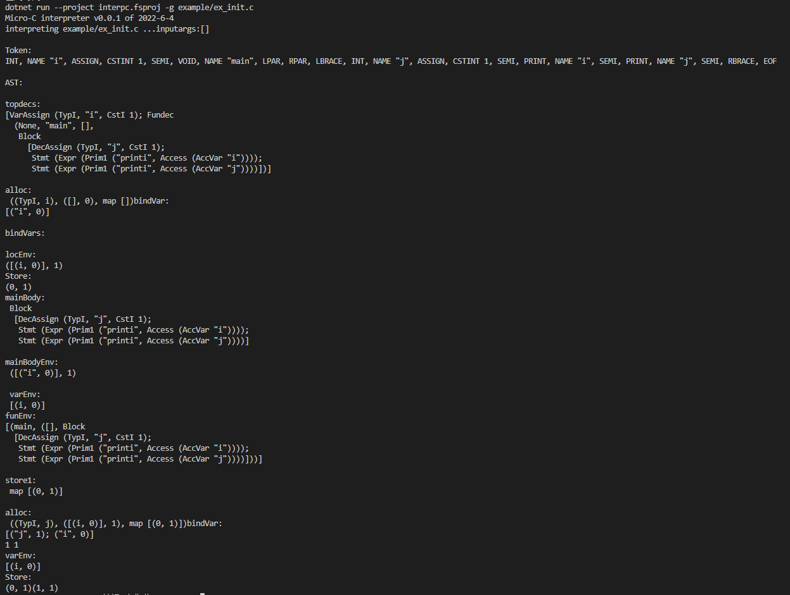

bool类型

```c
bool i = true;
void main() {
    bool j = true;
    if (j){
        print i;
    }
    print j;
}
```

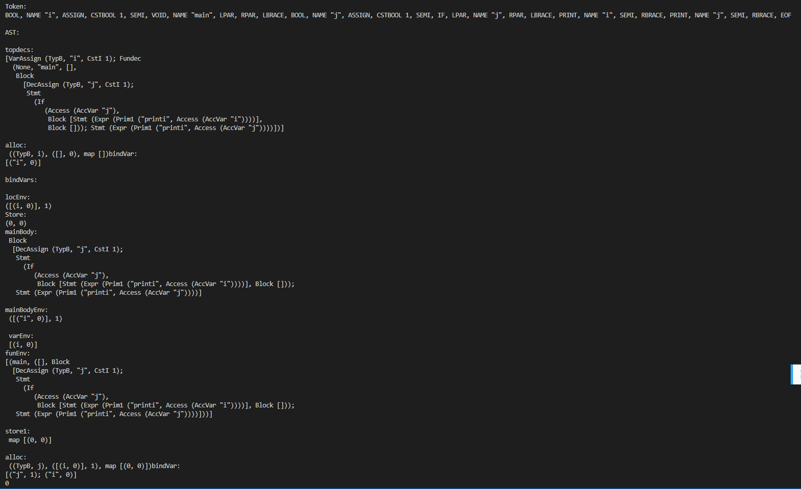

#### 包含所有特性的测试

```c
void main() {
    int s[8];
    int j = 0;
    for j < 8 {
        s[j] = j;
        print s[j];
        j++;
    }
    println;
    for j = 0; j < 8; j++ {
        s[j] = s[j] % 2 == 0? s[j] : mul(s[j]);
        print s[j];
    }
    println;
    int x;
    int y;
    for x,y = range s {
        print x;
        print y;
        println;
    }
    print s[8];
}

int mul(int x){
    return x*2;
}
```

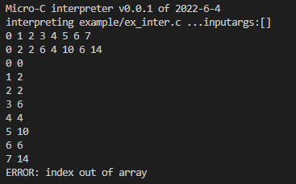

### 技术要点说明

#### go for循环

Clex词法定义


定义2种抽象语法


加入token和语法

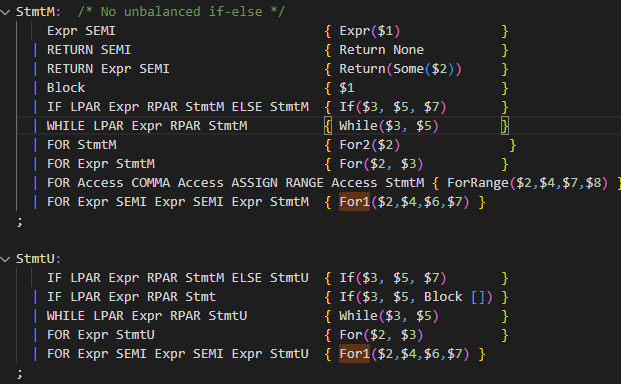

在解释器中定义两种for循环


#### 下标越界检查 & go for range

在range遍历数组时，需要知道数组长度。所以先在store中加入一个位置存放length，并且使用这个length来对数组下标做检查。

在allocate中额外存一个长度

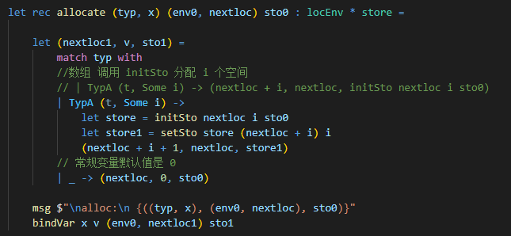

在access中对下标进行检查

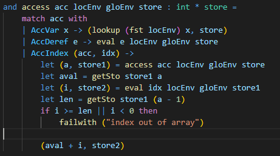

在go语言当中for range循环可以将list的下标赋值给k，对应的内容赋值给v并且自动遍历整个数组

```go
var k, v int
list := []int{1, 2, 3}
for k, v = range list {
    print(k, v)
}
```

加入关键字

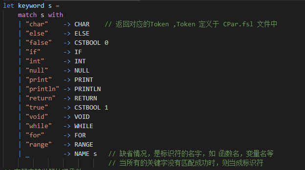

加入token和语法定义

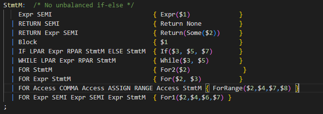

定义ForRange

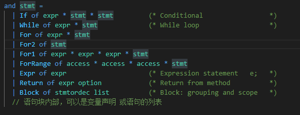

实现ForRange

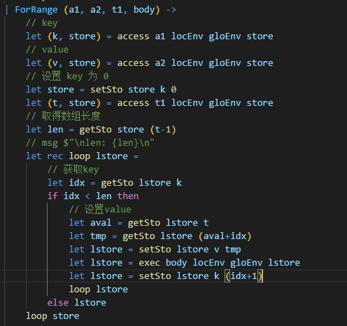

#### return支持

在return中，将返回值存入store的 -1位置

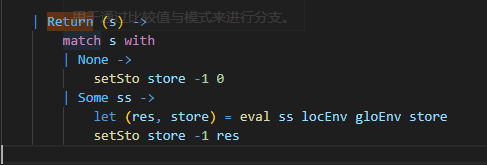

在callfun中获取store -1位置的值，并返回

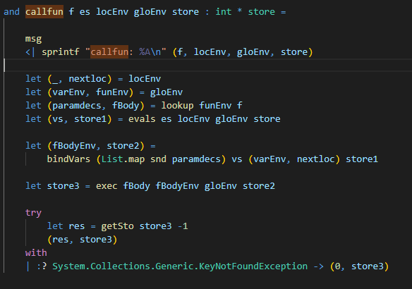

#### 变量初始化

变量初始化是赋值，需要对全局和本地分别实现

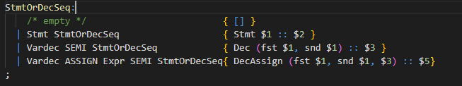

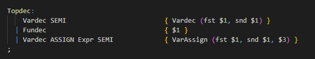

声明

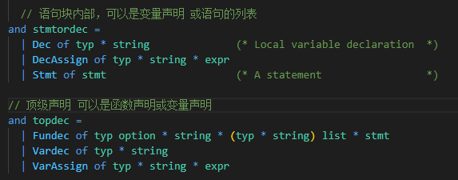

实现

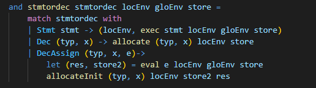

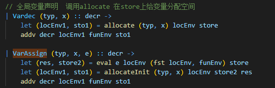

为了实现在allocate变量的同时赋值，自行定义了`allocateInit`函数，比allocate额外传入一个初始值

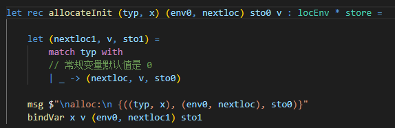

#### 布尔类型

定义类型

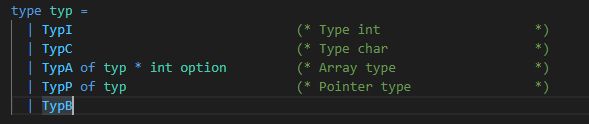

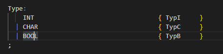

allocate实现

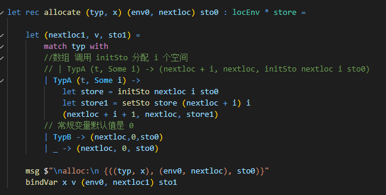


### 心得体会

#### 过程心得

#### 课程建议
