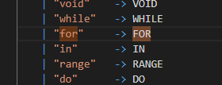

- [x] ++
- [x] --


项目自评表

为了方便测试，编写了一个简单的makefile

```makefile
FILENAME=ex_prime3.c
arg=8
run: clean
	dotnet run --project interpc.fsproj example/$(FILENAME) $(arg)

debug: clean
	dotnet run --project interpc.fsproj -g example/$(FILENAME) $(arg)

clean:
	dotnet clean interpc.fsproj
```

运行解释器

```bash
# 直接运行
make
# 以调试模式运行
make debug
# 添加参数
make debug arg=8
```


### 效果测试

#### 自增自减

```c
void main(int n) {
    ++n;
    print n;
    n++;
    print n;
    --n;
    print n;
    n--;
    print n;
}
```

token和抽象语法树


运行结果


#### 三目运算符

```c
void main(int n) {
    int x;
    x = n > 10 ? n : 10;
    print x;
}
```


#### 类go for循环

在go语言当中，for有3种形式

```go
for {}
for x < 10 {}
for i := 0; i < 10; i++ {}
```

实现其中两种

测试代码

```c
void main(int n) {
    int i;
    i = 0;
    for (i < n) {
        print i;
        i = i + 1;
    }
    println;
    int j;
    for (j=0; j<n;j++){
        print j;
    }
}
```


### 技术要点说明

#### 类go for循环

Clex词法定义



定义2种抽象语法


加入token和语法


在解释器中定义两种for循环


#### for range